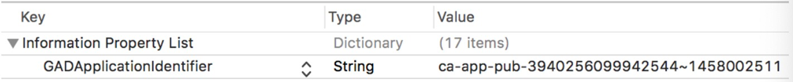
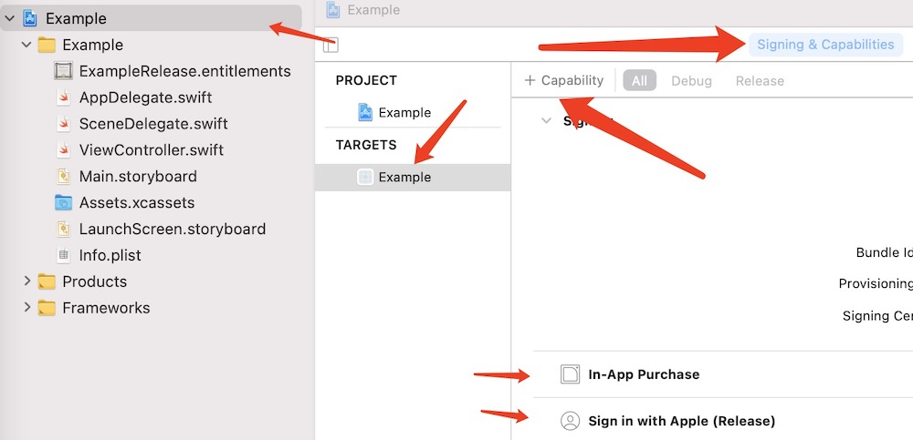
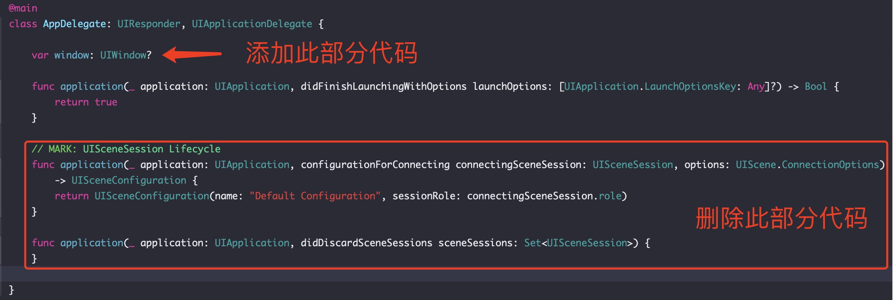
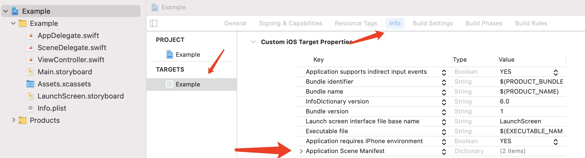
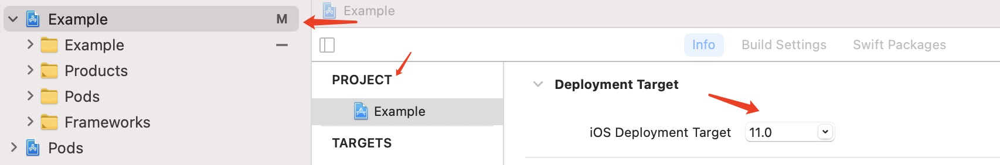
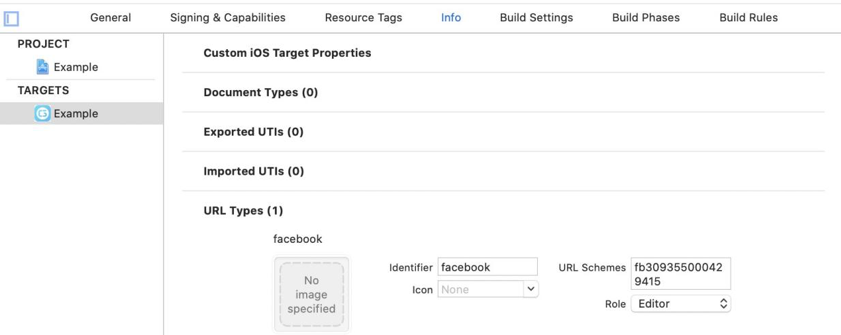
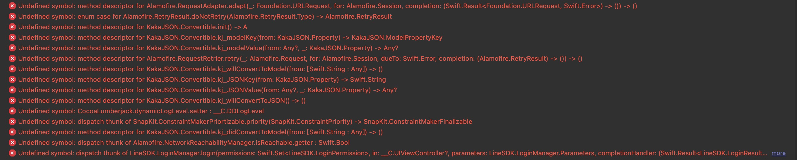
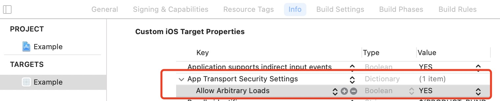

### 环境说明

SDK使用xcode12编译，xcode软件最低支持xcode12，应用最低支持iOS11.0，基于swift5。

## 一、导入 SDK

> 通过 `CocoaPods` 管理依赖, `CocoaPods` 是目前最流行的 `Cocoa` 项目库依赖管理工具之一，考虑到便捷与项目的可维护性，我们使用 `CocoaPods` 导入并管理 SDK ；

#### 1、CocoaPods安装

请参照 [CocoaPods 安装](https://cocoapods.org/)

#### 2、使用CocoaPods导入海外SDK

- 执行 `pod search GameOverseasSdk`
- `cd` 到 工程目录
- 执行 `pod init`，生成Podfile文件
- 编辑Podfile文件，添加如下内容

```ruby
platform :ios, '11.0'
target '项目名称' do
  # 使用静态库
  use_frameworks!
  # 海外SDK
  pod 'GameOverseasSdk', '~> 1.0.0' # 版本号根据需求填写
  # Twitter登录
  pod 'Swifter' , :git => 'https://github.com/mattdonnelly/Swifter.git'
end
```

- 执行 `pod install`，安装时长根据网络情况而定，如果安装失败需要再次执行安装命令
- 双击 `项目名称.xcworkspace` 文件打开项目

## 二、工程配置

#### 1、添加Bundle display name

广告和其他SDK相关功能需要用的这个字段，在您的应⽤的 Info.plist ⽂件中添加 Bundle display name 键，值根据应用实际情况填写或者使用 `$(PRODUCT_NAME)`。



#### 2、配置xcode的Capability，开启内购和apple登录选项

在Target -> Signing&Capabilities -> +**Capability** 中添加 **In-App Purchase** 和 **Sign In with Apple**。



#### 3、位置权限(广告展示时可选项)

SDK不会主动获取应⽤位置权限，设置广告开启地理位置之后需要添加权限，需要在应⽤的 info.plist 添加相应配置信息，可以借助获取的地理位置开关，提⾼⼴告填充率，增加⼴告收益。建议打开开关。

需要配置的键 `Privacy - Location When In Use Usage Description`, 值根据自身情况填写

#### 4、支持iOS11需要移除scene相关文件（具体参考示例工程）

- 删除 **SceneDelegate.swift** 文件

- **AppDelegate.swift** 文件修改

  

- **Info.plist** 删除 **Application Scene Manifest**

  

#### 5、设置xcode最低支持iOS11版本



## 三、接入流程

### 3.1、初始化接入

#### 3.1.1、初始化接口【客户端调用】(必接)

**在AppDelete中的didFinishLaunchingWithOptions中初始化SDK，具体使用参考示例Demo应用在Appdelete中必须调用SDK的****初始化方法、屏幕方向回调、设置SDK回调、否则SDK将无法正常工作，****具体使用参考示例Demo：**

**接口示例（**Swift版**）：**

```swift
let parameters = [QGOSSConfig.appkey: "",
                  QGOSSConfig.qdasKey: "",
                  QGOSSConfig.faceBookKey: "",
                  QGOSSConfig.adKey: "",
                  QGOSSConfig.adSpaceId: "",
		  QGOSSConfig.isAdTest: true,
		  QGOSSConfig.enableLocation: false,
                  QGOSSConfig.flyerKey: "",
                  QGOSSConfig.appleId: "",
]
QGOSSdkMatrix.registerSDK(application, launchOptions: launchOptions,parameters: parameters)
```

备注：key的申请请联系运营人员咨询，不能直接使用Demo中的key；字典传入的key需要使用SDK内置的key。


#### 3.1.2、应用支持方向接口【客户端调用】(必接)

**此方法必须接入，否则可能导致SDK部分页面展示异常**
**接口示例（**Swift版**）：**
**a.设置应用支持方向（必须实现）**

```swift
func application(_ application: UIApplication, supportedInterfaceOrientationsFor window: UIWindow?) -> UIInterfaceOrientationMask {
	return QGOSSdkMatrix.shared.supportInterfaceOriention
}
```

**b.设置默认方向（选接），默认横屏**

```swift
// 设置屏幕方向，根据具体需求设置
func application(_ application: UIApplication, didFinishLaunchingWithOptions launchOptions: [UIApplication.LaunchOptionsKey: Any]?) -> Bool {
	QGOSSdkMatrix.shared.supportInterfaceOriention = .all
	return true
}
```

#### 3.1.3、SDK回调接口【客户端调用】(必接)

用于回调通知SDK
**接口示例（**Swift版**）：**

```swift
func application(_ app: UIApplication, open url: URL, options: [UIApplication.OpenURLOptionsKey : Any] = [:]) -> Bool {
    QGOSSdkMatrix.handleOpenURL(app, open: url, options: options)
    return  true
}
```

### 3.2、功能接入

#### 3.2.1、登录【客户端调用】(必接)

应用调用SDK登录接口，SDK显示登录页面，引导用户进行登录与授权。每次登录成功，SDK会返回相应的用户用于身份识别的必需参数。
**接口示例：**

```swift
QGOSSdkMatrix.login(onSignIn: {(dict) in
  // 进行逻辑操作
}, onBindingAccount: {(dict) in
  // 应用进行绑定操作
  // 设置绑定回调，isBindingAccountSuccess的值根据绑定结果设置
  QGOSSdkMatrix.setBindingAccountResult(isBindingAccountSuccess: true)
})
```

**接口回调：**

- 登录成功或者失败都是通过onSignIn 进行回调，绑定结果通过onBindingAccount 回调（在游客升级的情况下），两者返回字典值如下：

```swift
[ "code": "0",               // 状态码：0成功；其它状态码代表失败
"message": "登录成功",    
"data": [
        "uUid": "",         // 用户id
        "sign": "",         // 签名值，用于调用服务端接口使用
        "deviceId":"",      // 设备id
        "loginType": ""]    // 登录方式 apple/facebook/tourist
]
```

- onBindingAccount 回调之后，自行处理绑定操作，绑定完成要通知SDK绑定结果，具体参考(3.4.6)，示例代码如下：

```swift
QGOSSdkMatrix.setBindingAccountResult(isBindingAccountSuccess: true)
```

#### 3.2.2、支付【客户端调用】

证书、配置文件、商品相关信息，请联系运营人员获取**（接口具体示例参考Demo）**
**接口示例：**

```swift
QGOSSdkMatrix.pay(appUserId: "111",
                  appUserName: "测试用户",
                  productId: "100",
                  productName: "测试商品",
                  productAmount: "1",
                  notiUrl: "http://mgame.360.cn/gamecp/status",
                  ipaProductIdentify: "com.qihoo.www.QHLoginSDKDemo_5",
                  onPaySuccess: { (msg) in
                    // 成功回调
                  },
                  onPayFailure: {(msg) in
                    // 失败回调
                 })
```

**接口回调：**
onPaySuccess支付为成功回调，onPayFailure支付失败回调，返回格式一致，具体格式如下：

```swift
[ 
  "code": "0",           // 状态码：0成功；其它状态码表登录失败 
  "message": "支付成功",  // 提示信息 
]
```

#### 3.2.3、广告【客户端调用】(必接)

广告使用Google AdMob广告功能和FaceBook广告功能，**key需要联系运营人员申请。**

**`QGOSSConfig.isAdTest` 用来切换线上与测试环境，在上线时必须要设置为`false`以免影响收益。**

**1、**[**Google AdMob广告配置:**]()
在您的应⽤的 Info.plist ⽂件中，添加⼀个字符串值为您的AdMob应⽤ID的  `GADApplicationIdentifier`键（**不添加初始化的情况下SDK会闪退**）


**注意：请务必使⽤您的实际 AdMob 应⽤ ID，⽽不是Demo的 ID **
**接口示例（Swift版）：**

```swift
QGOSSdkMatrix.loadAd(onAdShow: {() in
      	     // 广告展示
            },onReward: {() in
	     // 广告激励达到
            },onAdClick: {() in
	     // 广告点击
            },onAdClose: {() in
             // 广告页面关闭
	   },onRenderFailed: {(error) in
	     // 广告获取失败
            })
```

**广告请求失败可能的原因：**

- 应⽤包名，**appkey, adspaceid **必须匹配。（不能直接⽤**Demo**中的**appkey**和**adspaceid**在你的⼯程中请求⼴告）。 
- 模拟器不能保证⼴告填充。所以请⽤真机请求⼴告。
- 确保⽹络连接正常。（可⽤ Wi-Fi **和** 4G ⽹络分别请求⼴告验证）。
- 同⼀天，同⼀设备，⼴告展示有次数限制（可更换不同设备请求⼴告）。
- 测试设备不要限制⼴告跟踪（⼴告请求需要获取**idfa**）。 
- ⼴告请求不能保证每次都有⼴告返回。（⼴告不能频繁请求）

- 打开GPS精准⼴告定位开关，可以借助获取的地理位置开关，提⾼⼴告填充率，增加⼴告收益。建议打开开关并设置地理位置访问请求。
- **Demo内的adspaceid均为⼴告SDK内部所⽤，上线前需替换为正确⼴告位ID，否则将出现结算问题。**

#### 3.2.4、接入Facebook登录【客户端接入】

在接入Fcebook登录前，需要先配置Fcebook，**参数联系运营运营人员获取**。
选择Targets -> Info -> URL Types 添加Fcebook的url schemes参数（fb + facebookid格式），具体内容参考demo。



#### 3.2.5、接入Google登录【客户端接入】

在接入Google登录前，需要先配置GoogleKey，**参数联系运营运营人员获取**。
添加位置同FaceBook（3.2.4）所示，url schemes 示例如下：（根据申请的内容进行添加，不可使用demo内容）
com.googleusercontent.apps.1090314023709-q97a0iu7l79qope1e6opsqdvp2v98i9h

#### 3.2.6、接入Line登录【客户端接入】

在接入Line登录前，需要先配置LineKey，**参数联系运营运营人员获取**。
添加位置同FaceBook（3.2.4）所示，url schemes 直接添加内容如下（直接使用即可）：line3rdp.$(PRODUCT_BUNDLE_IDENTIFIER)

#### 3.2.7 接入Twitter登录【客户端接入】

在接入Twitter登录前，需要先配置Twitter相关Key，**参数联系运营运营人员获取**。

#### 3.2.8、接入Apple登录（iOS13及以上可用）【客户端接入】

1. 在开发者账号中对应的App ID 下的Capabilities中勾选 Sign In With Apple，然后重新生成新的Provisioning Profile文件下载安装。
1. 在Xcode中，选择Target->Signing & Capabilities 中添加Sign In With Apple；编译工程 并运行。

#### 3.2.9、升级游客模式为正式账号接口【客户端调用】

**接口调用：**

```swift
QGOSSdkMatrix.setBindingAccountResult(isBindingAccountSuccess: isBindSuccess)
```

游客模式升级为正式账号后，开发者完成了玩家账号数据合并后，需要调用此方法通知SDK合并是否成功。如果不通知，可能会导致用户信息紊乱。

**说明：**为方便玩家体验游戏，SDK提供了游客模式，玩家可以无登录体验游戏。但是游客模式容易丢失用户信息，所以SDK提供了升级为正式账号的功能。
QGOSSdkMatrix.login()接口的回调方法onBindingAccount()，就是游客升级为正式账号登录成功后，SDK返回给开发者用户信息的回调方法（具体返回数据请参考**3.2.1**）。开发者可以根据返回的用户信息，去做账号数据合并升级等业务处理（具体使用方法见Demo）。

#### 3.2.10、切换账号【客户端调用】

SDK提供的切换账号功能，具体参数参以及用法参考登录（3.2.1）
**接口示例：**

```swift
  QGOSSdkMatrix.changeAccount(onSignIn: {(dict) in
  }, onBindingAccount: {( dict ) in
  })
```

#### 3.2.11、退出登录

**接口示例：**

```swift
  QGOSSdkMatrix.loginOut(callbock: {})
```

### 3.3、服务端接入处理

#### 3.3.1、支付结果通知接口【服务端调用】

1. 应用客户端调用支付接口时，需指定支付结果的通知回调地址notify_uri。支付完成后，360服务器会把支付结果以GET方式通知到此地址(建议应用服务端接口同时支持GET和POST)。
1. **应用接收验证参数后，必须检查360SDK服务端支付结果通知接口中的以下参数与下单时游戏方记录的参数一致性，防止出现篡改。**

需校验参数：应用appkey(app_key)；360帐号id(m2_id)；应用分配给用户的id(app_uid)；应用自定义的商品id(product_id)；商品金额(amount)；应用扩展信息1；应用扩展信息2; 。

3. **需验证iap_verify_receipt中receipt_type值，为方便接入，会在apple pay的sandbox环境进行验证并返回ProductionSandbox标识，此时订单为测试订单，不能作为发货凭证。**

- 如果一致，则正常发货；
- 如果出现不一致，则可能出现交易信息篡改，需要停止发货。
- 支付结果通知的参数如下：

| **参数**           | **必选** | **参数类型** | **最大长度** | **参数说明**                                                 | **是否参与签名** |
| ------------------ | -------- | ------------ | ------------ | ------------------------------------------------------------ | ---------------- |
| app_key            | Y        | varchar      | 32           | 应用app key                                                  | Y                |
| product_id         | Y        | varchar      | 36           | 应用自定义的商品id                                           | Y                |
| amount             | Y        | int unsigned | 11           | 商品金额,以分为单位                                          | Y                |
| app_uid            | Y        | varchar      | 50           | 应用分配给用户的id                                           | Y                |
| app_ext1           | N        | varchar      | 255          | 应用扩展信息1原样返回                                        | Y                |
| app_ext2           | N        | varchar      | 255          | 应用扩展信息2原样返回                                        | Y                |
| user_id            | Y        | varchar      | 64           | 360帐号id                                                    | Y                |
| order_id           | Y        | varchar      | 32           | 360返回的支付订单号                                          | Y                |
| gateway_flag       | Y        | varchar      | 16           | 如果支付返回成功，返回success应用需要确认是success才给用户加钱 | Y                |
| sign_type          | Y        | varchar      | 8            | 定值 md5                                                     | Y                |
| app_order_id       | N        | varchar      | 64           | 应用订单号支付请求时传递，原样返回                           | Y                |
| iap_verify_receipt | Y        | varchar      | 2048         | apple pay验证票据返回结果                                    | Y                |
| sign_return        | Y        | varchar      | 32           | 应用回传给订单核实接口的参数不加入签名校验计算               | N                |
| sign               | Y        | varchar      | 32           | 签名                                                         | N                |


- **应用接收到支付平台回调的请求，参见附录的签名算法对参数进行签名，然后和平台传递的签名sign比较，从而校验平台请求的合法性.**
  - **通知消息样例:**
    - order_id=2008256446277274092&app_key=testios&product_id=100&amount=1&app_uid=111&sign_type=md5&m2_id=7b72535d902d0f2fee51d9612f224ff4&iap_verify_receipt=%7B%22status%22%3A0%2C%22receipt_type%22%3A%22ProductionSandbox%22%7D&gateway_flag=success&sign=xxxxxxxxxxxxxxxxxxxxxxxxxxxxxxxx&sign_return=xxxxxxxxxxxxxxxxxxxxxxxxxxxxxxxx
  - **样例的签名字段排列** (列出来仅供参考, 请根据实际参数情况用程序排序产生, 不要写死在程序里)
    - amount, app_ext1, app_key, app_order_id, app_uid, gateway_flag, iap_verify_receipt, order_id, product_id, sign_type, user_id
  - **样例的签名串**
    - 1#testios#111#success#{"status":0,"receipt_type":"ProductionSandbox"}#7d0f1a2b4e2a98d74df42afa9d0a4195#2008313968047438442#100#md5#应用app_secret

**4.应用服务端在接收到通知消息并校验后, 需将通知接收状态、商品/道具最终发货结果状态及未发货原因回应给360服务端：**
以utf8 编码json格式应答;
应答格式及字段：{"status":"ok","delivery":"success","msg":""}
字段说明：（加粗字段为不可更改key值，且必须为小写）

| **参数** | **必选** | **参数类型** | **最大长度** | **参数说明**                                                 | **取值范围**           |
| -------- | -------- | ------------ | ------------ | ------------------------------------------------------------ | ---------------------- |
| status   | Y        | string       | 16           | 接收通知状态，status应答"ok"表示通知已经接收，360通知不再重发。如果该字段回应其他值或者不回应,则被认为通知失败,360会尝试多次通知.以避免掉单。 | ok,error               |
| delivery | Y        | string       | 32           | 商品/道具最终发货结果状态，其中“mismatch”表示通知中360用户id或游戏用户id与游戏方下单时记录的值不同 | success,mismatch,other |
| msg      | Y        | string       | 64           | 当发货状态为非success时说明原因，用于用户向360咨询时进行说明 | 自定义                 |


**注:应用应做好接收到多次通知的准备，防止多次加钱。对于重复的通知，应用可能发现订单已经成功处理完毕，无需继续处理，也应返回应答**。 否则，360会认为未成功通知，会继续发送通知。

#### 3.3.2、订单核实接口【服务端调用】

1.  验证接口地址为:[https://pay.digitalplushk.com/pay/order_verify.json](https://pay.digitalplushk.com/pay/order_verify.json)
2.  为了安全起见，验证参数不需要传client_id,client_secret参数，如果传了服务端会报错
3.  需要计算签名
    为了防止伪造的支付成功通知, 应用可以使用本接口做通知数据的校验.把支付结果通知接口(3.3.3节)收到的通知消息里的参数, 计算签名后调用接口, 即可校验数据是否正确.
    
**接口地址**：[https://pay.digitalplushk.com/pay/order_verify.json?](https://pay.digitalplushk.com/pay/order_verify.json?)

**参数说明**

| **参数**     | **必选** | **参数说明**                                                 |
| ------------ | -------- | ------------------------------------------------------------ |
| app_key      | Y        | 应用app key                                                  |
| product_id   | Y        | 应用自定义的商品id                                           |
| amount       | Y        | 总价,单位：分                                                |
| app_uid      | Y        | 应用分配给用户的id                                           |
| order_id     | Y        | 360支付订单号                                                |
| app_order_id | N        | 应用订单号下单时若指定验证时也要指定                         |
| app_ext1     | N        | 应用扩展信息1                                                |
| app_ext2     | N        | 应用扩展信息2                                                |
| is_sms       | N        | 是否短信支付                                                 |
| bank_code    | N        | 支付方式                                                     |
| pay_ext      | N        | 扩展信息                                                     |
| sign_type    | Y        | 当前仅支持md5                                                |
| sign_return  | Y        | 应用传给订单核实接口的参数sign_return                        |
| sign         | Y        | **签名(计算方法参考附录6.1节，本表格中除sign以外的所有参数均参与签名)** |

参数均来自应用加钱接口收到的支付通知消息, 原样提供即可。
如果参数提供正确, 订单核实接口返回为json格式数据。
**验证成功返回**

```json
{"ret":"verified"}
```

**验证不成功返回**

```json
{"ret":"{错误信息}"}
```

返回结果中的错误信息包括包括但不限于

| **错误信息**         | **错误说明**                                           |
| -------------------- | ------------------------------------------------------ |
| order not exists     | 订单不存在                                             |
| product_id not match | 订单验证传入的product_id和下单时传入的product_id不一致 |
| amount not match     | 验证金额与下单时金额不一致                             |
| user_id not match    | 验证360用户id和下单时360用户id不一致                   |
| bank_code not match  | 验证支付方式和下单时支付方式不一致                     |


## 四、其它

#### 4.1、签名算法

签名算法不区分前后端，只要在需要签名的地方，均采用如下的算法

- 必选参数必须有值, 而且参数值必须不为空，不为0. 字符集为utf-8
- 所有不为空，不为0的参数都需要加入签名，参数必须为做urlencode之前的原始数值. 如中文金币, 作为参数传输时编码为%E9%87%91%E5%B8%81,做签名时则要用其原始中文值金币 (注意字符集必须是UTF-8)
- 对所有不为空的参数按照参数名字母升序排列(如php的ksort函数)
- 使用符号#拼装排序后的参数值, 最后用#连接应用的app_secret,整体用md5计算签名, 就是sign参数的值. 注意有些语言的md5计算结果里字母为大写, 需要转化为小写.
- 拼装url进行WEB传递, 这时参数值要做urlencode

php范例如下：

```php
// 准备签名参数
$input = array(…);
/*  去掉为空的字段 */
foreach($input as $k=>$v)
{
	if(empty($v)){
		unset($input[$k]);
	}
}
ksort($input);//对参数按照key进行排序
$sign_str = implode('#',$input);//第四步
$sign_str = $sign_str.'#'.$sign_key;//拼装密钥（如果是签名，密钥为约定处理后的密钥）
$sign = md5($sign_str);
$input['sign'] = $sign;//得到签名
/* 第五步得到url传递即可*/
//这里地址就是一个演示的接口地址
$url = 'http://testapp.com/notify?'.http_build_query($input);
…
```

#### 4.2、用户信息校验

返回值

| **返回值** | **类型** | 说明       |
| ---------- | -------- | ---------- |
| uid        | string   | 用户id     |
| sign       | string   | 用户id签名 |

签名规则

  1. 用户id和secret用井号拼接{uid}#{secret}
  2. 对得到的字符串进行md5
     例：uid=43be2813e273b2710cf353cc5fdcfca6 secret=7994145b510d9bf0c470e3141dbb65a5
      sign = md5(43be2813e273b2710cf353cc5fdcfca6#7994145b510d9bf0c470e3141dbb65a5)

## 五、常见错误

#### 1、pod install相关

先注释掉Podfile的  `#use_frameworks!`  然后 `pod install`，再次打开注释的`use_frameworks!`，再`pod install` 即可



#### 2、Google AdMob相关，未配置Google广告相关配置，参考（3.2.3）

Terminating app due to uncaught exception 'GADInvalidInitializationException', reason: 'The Google Mobile Ads SDK was initialized without an application ID. Google AdMob publishers, follow instructions here: https://googlemobileadssdk.page.link/admob-ios-update-plist to set GADApplicationIdentifier with a valid app ID. Google Ad Manager publishers, follow instructions here: https://googlemobileadssdk.page.link/ad-manager-ios-update-plist'

#### 3、http无法发起网络访问

在 `Info.plist` 添加 `App Transport Security Settings`, 然后在其下面添加 `Allow Arbitrary Loads` 值为 `YES`


